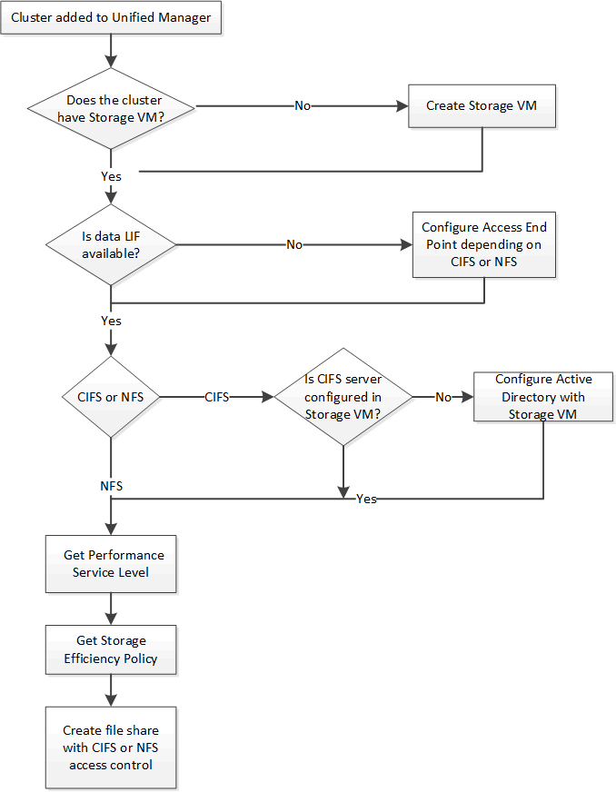

= Fornire condivisioni di file CIFS e NFS utilizzando le API
:allow-uri-read: 
:icons: font
:imagesdir: ../media/

[role="lead"]
È possibile effettuare il provisioning di condivisioni CIFS e condivisioni file NFS sulle macchine virtuali di archiviazione (SVM) utilizzando le API di provisioning fornite come parte di Active IQ Unified Manager.  Questo flusso di lavoro di provisioning descrive in dettaglio i passaggi per recuperare le chiavi delle SVM, i livelli di servizio delle prestazioni e i criteri di efficienza dell'archiviazione prima di creare le condivisioni file.

Il diagramma seguente illustra ogni passaggio di un flusso di lavoro di provisioning della condivisione file.  Include il provisioning sia delle condivisioni CIFS che delle condivisioni file NFS.

[NOTE]
====
Assicurarsi che:

* I cluster ONTAP sono stati aggiunti a Unified Manager ed è stata ottenuta la chiave del cluster.
* Sono state create delle SVM sui cluster.
* Le SVM supportano i servizi CIFS e NFS.  Il provisioning delle condivisioni file potrebbe non riuscire se le SVM non supportano i servizi richiesti.
* La porta FCP è online per il provisioning delle porte.

====
. Determinare se i LIF dati o gli endpoint di accesso sono disponibili sull'SVM su cui si desidera creare la condivisione CIFS.  Ottieni l'elenco degli endpoint di accesso disponibili sull'SVM:
+
[cols="3*"]
|===
| Categoria | Verbo HTTP | Sentiero 

 a| 
fornitore di storage
 a| 
OTTENERE
 a| 
`/storage-provider/access-endpoints`
`/storage-provider/access-endpoints/\{key}`

|===
+
*Esempio di cURL*

+
[listing]
----
curl -X GET "https://<hostname>/api/storage-provider/access-endpoints?resource.key=7d5a59b3-953a-11e8-8857-00a098dcc959" -H "accept: application/json" -H "Authorization: Basic <Base64EncodedCredentials>"
----
. Se l'endpoint di accesso è disponibile nell'elenco, ottenere la chiave dell'endpoint di accesso, altrimenti creare l'endpoint di accesso.
+
[NOTE]
====
Assicurarsi di creare endpoint di accesso su cui sia abilitato il protocollo CIFS.  Il provisioning delle condivisioni CIFS non riesce a meno che non sia stato creato un endpoint di accesso con il protocollo CIFS abilitato.

====
+
[cols="3*"]
|===
| Categoria | Verbo HTTP | Sentiero 

 a| 
fornitore di storage
 a| 
INVIARE
 a| 
`/storage-provider/access-endpoints`

|===
+
*Esempio di cURL*

+
È necessario immettere i dettagli dell'endpoint di accesso che si desidera creare come parametri di input.

+
[listing]
----
curl -X POST "https://<hostname>/api/storage-provider/access-endpoints" -H "accept: application/json" -H "Content-Type: application/json" -H "Authorization: Basic <Base64EncodedCredentials>"
{ \"data_protocols\": \"nfs\",
\"fileshare\": { \"key\": \"cbd1757b-0580-11e8-bd9d-00a098d39e12:type=volume,uuid=f3063d27-2c71-44e5-9a69-a3927c19c8fc\" },
\"gateway\": \"10.132.72.12\",
\"ip\": { \"address\": \"10.162.83.26\",
\"ha_address\": \"10.142.83.26\",
\"netmask\": \"255.255.0.0\" },
\"lun\": { \"key\": \"cbd1757b-0580-11e8-bd9d-00a098d39e12:type=lun,uuid=d208cc7d-80a3-4755-93d4-5db2c38f55a6\" },
\"mtu\": 15000, \"name\": \"aep1\",
\"svm\": { \"key\": \"cbd1757b-0580-11e8-bd9d-00a178d39e12:type=vserver,uuid=1d1c3198-fc57-11e8-99ca-00a098d38e12\" },
\"vlan\": 10}"
----
+
L'output JSON visualizza una chiave dell'oggetto Job che puoi utilizzare per verificare l'endpoint di accesso creato.

. Verificare l'endpoint di accesso:
+
[cols="3*"]
|===
| Categoria | Verbo HTTP | Sentiero 

 a| 
server di gestione
 a| 
OTTENERE
 a| 
`/management-server/jobs/\{key}`

|===
. Determina se devi creare una condivisione CIFS o una condivisione file NFS.  Per creare condivisioni CIFS, seguire questi passaggi:
+
.. Determinare se il server CIFS è configurato sulla SVM, ovvero se è stata creata una mappatura di Active Directory sulla SVM.
+
[cols="3*"]
|===
| Categoria | Verbo HTTP | Sentiero 

 a| 
fornitore di storage
 a| 
OTTENERE
 a| 
`/storage-provider/active-directories-mappings`

|===
.. Se il mapping di Active Directory è stato creato, prendere la chiave, altrimenti creare il mapping di Active Directory sull'SVM.
+
[cols="3*"]
|===
| Categoria | Verbo HTTP | Sentiero 

 a| 
fornitore di storage
 a| 
INVIARE
 a| 
`/storage-provider/active-directories-mappings`

|===
+
*Esempio di cURL*

+
È necessario immettere i dettagli per la creazione del mapping di Active Directory come parametri di input.

+
[listing]
----
curl -X POST "https://<hostname>/api/storage-provider/active-directories-mappings" -H "accept: application/json" -H "Content-Type: application/json" -H "Authorization: Basic <Base64EncodedCredentials>"
{ \"_links\": {},
\"dns\": \"10.000.000.000\",
\"domain\": \"example.com\",
\"password\": \"string\",
\"svm\": { \"key\": \"9f4ddea-e395-11e9-b660-005056a71be9:type=vserver,uuid=191a554a-f0ce-11e9-b660-005056a71be9\" },
\"username\": \"string\"}"
----
+
Si tratta di una chiamata sincrona ed è possibile verificare la creazione del mapping di Active Directory nell'output.  In caso di errore, viene visualizzato un messaggio di errore per consentirti di risolvere il problema e rieseguire la richiesta.

. Ottenere la chiave SVM per l'SVM su cui si desidera creare la condivisione CIFS o la condivisione file NFS, come descritto nell'argomento del flusso di lavoro _Verifica delle SVM sui cluster_.
. Ottieni la chiave per il Performance Service Level eseguendo la seguente API e recuperando la chiave dalla risposta.
+
[cols="3*"]
|===
| Categoria | Verbo HTTP | Sentiero 

 a| 
fornitore di storage
 a| 
OTTENERE
 a| 
`/storage-provider/performance-service-levels`

|===
+
[NOTE]
====
È possibile recuperare i dettagli dei livelli di servizio delle prestazioni definiti dal sistema impostando `system_defined` parametro di input a `true` .  Dall'output, ottenere la chiave del Performance Service Level che si desidera applicare alla condivisione file.

====
. Facoltativamente, è possibile ottenere la chiave Storage Efficiency Policy per la Storage Efficiency Policy che si desidera applicare alla condivisione file eseguendo la seguente API e recuperando la chiave dalla risposta.
+
[cols="3*"]
|===
| Categoria | Verbo HTTP | Sentiero 

 a| 
fornitore di storage
 a| 
OTTENERE
 a| 
`/storage-provider/storage-efficiency-policies`

|===
. Crea la condivisione file.  È possibile creare una condivisione file che supporti sia CIFS che NFS specificando l'elenco di controllo degli accessi e i criteri di esportazione.  I seguenti sotto-passaggi forniscono informazioni se si desidera creare una condivisione file per supportare solo uno dei protocolli sul volume.  È anche possibile aggiornare una condivisione file NFS per includere l'elenco di controllo degli accessi dopo aver creato la condivisione NFS.  Per informazioni, vedere l'argomento _Modifica dei carichi di lavoro di archiviazione_.
+
.. Per creare solo una condivisione CIFS, raccogliere le informazioni sull'elenco di controllo degli accessi (ACL).  Per creare la condivisione CIFS, fornire valori validi per i seguenti parametri di input.  Per ogni gruppo di utenti assegnato, viene creato un ACL quando viene fornita una condivisione CIFS/SMB.  In base ai valori immessi per l'ACL e il mapping di Active Directory, il controllo di accesso e il mapping vengono determinati per la condivisione CIFS al momento della sua creazione.
+
*Un comando cURL con valori di esempio*

+
[listing]
----
{
  "access_control": {
    "acl": [
      {
        "permission": "read",
        "user_or_group": "everyone"
      }
    ],
    "active_directory_mapping": {
      "key": "3b648c1b-d965-03b7-20da-61b791a6263c"
    },
----
.. Per creare solo una condivisione file NFS, raccogliere le informazioni sulla policy di esportazione.  Per creare la condivisione file NFS, fornire valori validi per i seguenti parametri di input.  In base ai valori specificati, il criterio di esportazione viene associato alla condivisione file NFS al momento della creazione.
+
[NOTE]
====
Durante il provisioning della condivisione NFS, è possibile creare un criterio di esportazione specificando tutti i valori richiesti oppure specificare la chiave del criterio di esportazione e riutilizzare un criterio di esportazione esistente.  Se si desidera riutilizzare un criterio di esportazione per la VM di archiviazione, è necessario aggiungere la chiave del criterio di esportazione.  A meno che non si conosca la chiave, è possibile recuperare la chiave della policy di esportazione utilizzando `/datacenter/protocols/nfs/export-policies` API.  Per creare una nuova policy, è necessario immettere le regole come mostrato nell'esempio seguente.  Per le regole immesse, l'API tenta di cercare una policy di esportazione esistente confrontando l'host, la VM di archiviazione e le regole.  Se esiste una politica di esportazione, questa viene utilizzata.  In caso contrario, verrà creata una nuova politica di esportazione.

====
+
*Un comando cURL con valori di esempio*

+
[listing]
----
"export_policy": {
      "key": "7d5a59b3-953a-11e8-8857-00a098dcc959:type=export_policy,uuid=1460288880641",
      "name_tag": "ExportPolicyNameTag",
      "rules": [
        {
          "clients": [
            {
              "match": "0.0.0.0/0"
            }
----

+
Dopo aver configurato l'elenco di controllo degli accessi e la policy di esportazione, fornire i valori validi per i parametri di input obbligatori per le condivisioni file CIFS e NFS:

[NOTE]
====
Storage Efficiency Policy è un parametro facoltativo per la creazione di condivisioni di file.

====
[cols="3*"]
|===
| Categoria | Verbo HTTP | Sentiero 

 a| 
fornitore di storage
 a| 
INVIARE
 a| 
`/storage-provider/file-shares`

|===
L'output JSON visualizza una chiave dell'oggetto Job che puoi utilizzare per verificare la condivisione file creata. .  Verificare la creazione della condivisione file utilizzando la chiave dell'oggetto Job restituita durante la query del job:

[cols="3*"]
|===
| Categoria | Verbo HTTP | Sentiero 

 a| 
server di gestione
 a| 
OTTENERE
 a| 
`/management-server/jobs/\{key}`

|===
Alla fine della risposta viene visualizzata la chiave della condivisione file creata.

[listing]
----

    ],
    "job_results": [
        {
            "name": "fileshareKey",
            "value": "7d5a59b3-953a-11e8-8857-00a098dcc959:type=volume,uuid=e581c23a-1037-11ea-ac5a-00a098dcc6b6"
        }
    ],
    "_links": {
        "self": {
            "href": "/api/management-server/jobs/06a6148bf9e862df:-2611856e:16e8d47e722:-7f87"
        }
    }
}
----
. Verificare la creazione della condivisione file eseguendo la seguente API con la chiave restituita:
+
[cols="3*"]
|===
| Categoria | Verbo HTTP | Sentiero 

 a| 
fornitore di storage
 a| 
OTTENERE
 a| 
`/storage-provider/file-shares/\{key}`

|===
+
*Esempio di output JSON*

+
Si può vedere che il metodo POST di `/storage-provider/file-shares` richiama internamente tutte le API richieste per ciascuna delle funzioni e crea l'oggetto.  Ad esempio, invoca il `/storage-provider/performance-service-levels/` API per l'assegnazione del livello di servizio delle prestazioni sulla condivisione file.

+
[listing]
----
{
    "key": "7d5a59b3-953a-11e8-8857-00a098dcc959:type=volume,uuid=e581c23a-1037-11ea-ac5a-00a098dcc6b6",
    "name": "FileShare_377",
    "cluster": {
        "uuid": "7d5a59b3-953a-11e8-8857-00a098dcc959",
        "key": "7d5a59b3-953a-11e8-8857-00a098dcc959:type=cluster,uuid=7d5a59b3-953a-11e8-8857-00a098dcc959",
        "name": "AFFA300-206-68-70-72-74",
        "_links": {
            "self": {
                "href": "/api/datacenter/cluster/clusters/7d5a59b3-953a-11e8-8857-00a098dcc959:type=cluster,uuid=7d5a59b3-953a-11e8-8857-00a098dcc959"
            }
        }
    },
    "svm": {
        "uuid": "b106d7b1-51e9-11e9-8857-00a098dcc959",
        "key": "7d5a59b3-953a-11e8-8857-00a098dcc959:type=vserver,uuid=b106d7b1-51e9-11e9-8857-00a098dcc959",
        "name": "RRT_ritu_vs1",
        "_links": {
            "self": {
                "href": "/api/datacenter/svm/svms/7d5a59b3-953a-11e8-8857-00a098dcc959:type=vserver,uuid=b106d7b1-51e9-11e9-8857-00a098dcc959"
            }
        }
    },
    "assigned_performance_service_level": {
        "key": "1251e51b-069f-11ea-980d-fa163e82bbf2",
        "name": "Value",
        "peak_iops": 75,
        "expected_iops": 75,
        "_links": {
            "self": {
                "href": "/api/storage-provider/performance-service-levels/1251e51b-069f-11ea-980d-fa163e82bbf2"
            }
        }
    },
    "recommended_performance_service_level": {
        "key": null,
        "name": "Idle",
        "peak_iops": null,
        "expected_iops": null,
        "_links": {}
    },
    "space": {
        "size": 104857600
    },
    "assigned_storage_efficiency_policy": {
        "key": null,
        "name": "Unassigned",
        "_links": {}
    },
    "access_control": {
        "acl": [
            {
                "user_or_group": "everyone",
                "permission": "read"
            }
        ],
        "export_policy": {
            "id": 1460288880641,
            "key": "7d5a59b3-953a-11e8-8857-00a098dcc959:type=export_policy,uuid=1460288880641",
            "name": "default",
            "rules": [
                {
                    "anonymous_user": "65534",
                    "clients": [
                        {
                            "match": "0.0.0.0/0"
                        }
                    ],
                    "index": 1,
                    "protocols": [
                        "nfs3",
                        "nfs4"
                    ],
                    "ro_rule": [
                        "sys"
                    ],
                    "rw_rule": [
                        "sys"
                    ],
                    "superuser": [
                        "none"
                    ]
                },
                {
                    "anonymous_user": "65534",
                    "clients": [
                        {
                            "match": "0.0.0.0/0"
                        }
                    ],
                    "index": 2,
                    "protocols": [
                        "cifs"
                    ],
                    "ro_rule": [
                        "ntlm"
                    ],
                    "rw_rule": [
                        "ntlm"
                    ],
                    "superuser": [
                        "none"
                    ]
                }
            ],
            "_links": {
                "self": {
                    "href": "/api/datacenter/protocols/nfs/export-policies/7d5a59b3-953a-11e8-8857-00a098dcc959:type=export_policy,uuid=1460288880641"
                }
            }
        }
    },
    "_links": {
        "self": {
            "href": "/api/storage-provider/file-shares/7d5a59b3-953a-11e8-8857-00a098dcc959:type=volume,uuid=e581c23a-1037-11ea-ac5a-00a098dcc6b6"
        }
    }
}
----

