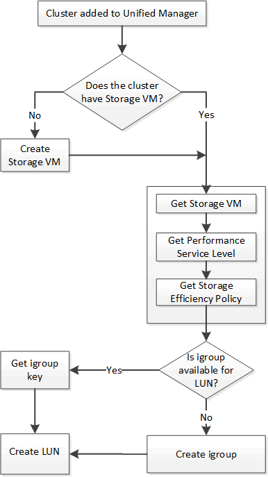

= Fornire LUN tramite API
:allow-uri-read: 
:icons: font
:imagesdir: ../media/

[role="lead"]
È possibile effettuare il provisioning delle LUN sulle macchine virtuali di archiviazione (SVM) utilizzando le API di provisioning fornite come parte di Active IQ Unified Manager.  Questo flusso di lavoro di provisioning descrive in dettaglio i passaggi per recuperare le chiavi delle SVM, dei livelli di servizio delle prestazioni e dei criteri di efficienza dell'archiviazione prima di creare la LUN.

Il diagramma seguente illustra i passaggi di un flusso di lavoro di provisioning LUN.

[NOTE]
====
Questo flusso di lavoro presuppone che i cluster ONTAP siano stati aggiunti a Unified Manager e che sia stata ottenuta la chiave del cluster.  Il flusso di lavoro presuppone inoltre che le SVM siano già state create sui cluster.

====
. Ottenere la chiave SVM per l'SVM su cui si desidera creare la LUN, come descritto nell'argomento del flusso di lavoro _Verifica delle SVM sui cluster_.
. Ottieni la chiave per il Performance Service Level eseguendo la seguente API e recuperando la chiave dalla risposta.
+
[cols="3*"]
|===
| Categoria | Verbo HTTP | Sentiero 

 a| 
fornitore di storage
 a| 
OTTENERE
 a| 
`/storage-provider/performance-service-levels`

|===
+
[NOTE]
====
È possibile recuperare i dettagli dei livelli di servizio delle prestazioni definiti dal sistema impostando `system_defined` parametro di input a `true` .  Dall'output, ottenere la chiave del Performance Service Level che si desidera applicare alla LUN.

====
. Facoltativamente, è possibile ottenere la chiave Storage Efficiency Policy per la Storage Efficiency Policy che si desidera applicare alla LUN eseguendo la seguente API e recuperando la chiave dalla risposta.
+
[cols="3*"]
|===
| Categoria | Verbo HTTP | Sentiero 

 a| 
fornitore di storage
 a| 
OTTENERE
 a| 
`/storage-provider/storage-efficiency-policies`

|===
. Determinare se sono stati creati gruppi di iniziatori (igroup) per concedere l'accesso alla destinazione LUN che si desidera creare.
+
[cols="3*"]
|===
| Categoria | Verbo HTTP | Sentiero 

 a| 
centro dati
 a| 
OTTENERE
 a| 
`/datacenter/protocols/san/igroups`  `/datacenter/protocols/san/igroups/\{key}`

|===
+
È necessario immettere il valore del parametro per indicare l'SVM per il quale l'igroup ha accesso autorizzato.  Inoltre, se si desidera interrogare un particolare igroup, immettere il nome dell'igroup (chiave) come parametro di input.

. Nell'output, se riesci a trovare l'igroup a cui vuoi concedere l'accesso, ottieni la chiave.  Altrimenti creare l'igroup.
+
[cols="3*"]
|===
| Categoria | Verbo HTTP | Sentiero 

 a| 
centro dati
 a| 
INVIARE
 a| 
`/datacenter/protocols/san/igroups`

|===
+
È necessario immettere i dettagli dell'igroup che si desidera creare come parametri di input.  Questa è una chiamata sincrona ed è possibile verificare la creazione dell'igroup nell'output.  In caso di errore, viene visualizzato un messaggio che consente di risolvere il problema e di rieseguire l'API.

. Creare il LUN.
+
[cols="3*"]
|===
| Categoria | Verbo HTTP | Sentiero 

 a| 
fornitore di storage
 a| 
INVIARE
 a| 
`/storage-provider/luns`

|===
+
Per creare il LUN, assicurarsi di aver aggiunto i valori recuperati come parametri di input obbligatori.

+
[NOTE]
====
Storage Efficiency Policy è un parametro facoltativo per la creazione di LUN.

====
+
*Esempio di cURL*

+
È necessario immettere tutti i dettagli della LUN che si desidera creare come parametri di input.

+
L'output JSON visualizza una chiave dell'oggetto Job che puoi utilizzare per verificare il LUN creato.

. Verificare la creazione del LUN utilizzando la chiave dell'oggetto Job restituita durante la query del Job:
+
[cols="3*"]
|===
| Categoria | Verbo HTTP | Sentiero 

 a| 
server di gestione
 a| 
OTTENERE
 a| 
`/management-server/jobs/\{key}`

|===
+
Alla fine della risposta viene visualizzata la chiave del LUN creato.

. Verificare la creazione del LUN eseguendo la seguente API con la chiave restituita:
+
[cols="3*"]
|===
| Categoria | Verbo HTTP | Sentiero 

 a| 
fornitore di storage
 a| 
OTTENERE
 a| 
`/storage-provider/luns/\{key}`

|===
+
*Esempio di output JSON*

+
Si può vedere che il metodo POST di `/storage-provider/luns` richiama internamente tutte le API richieste per ciascuna delle funzioni e crea l'oggetto.  Ad esempio, invoca il `/storage-provider/performance-service-levels/` API per l'assegnazione del livello di servizio delle prestazioni sulla LUN.

+
== Passaggi per la risoluzione dei problemi in caso di errore nella creazione o nella mappatura LUN

Anche dopo aver completato questo flusso di lavoro, potresti comunque riscontrare un errore nella creazione del LUN.  Anche se la LUN viene creata correttamente, il mapping della LUN con l'igroup potrebbe non riuscire a causa della mancata disponibilità di un SAN LIF o di un endpoint di accesso sul nodo su cui si crea la LUN.  In caso di errore, verrà visualizzato il seguente messaggio:

[listing]
----
The nodes <node_name> and <partner_node_name> have no LIFs configured with the iSCSI or FCP protocol for Vserver <server_name>. Use the access-endpoints API to create a LIF for the LUN.
----
Per risolvere questo problema, seguire questi passaggi per la risoluzione dei problemi.

. Creare un endpoint di accesso che supporti il protocollo ISCSI/FCP sull'SVM su cui si è tentato di creare il LUN.
+
[cols="3*"]
|===
| Categoria | Verbo HTTP | Sentiero 

 a| 
fornitore di storage
 a| 
INVIARE
 a| 
`/storage-provider/access-endpoints`

|===
+
*Esempio di cURL*

+
È necessario immettere i dettagli dell'endpoint di accesso che si desidera creare come parametri di input.

+
[NOTE]
====
Assicurarsi di aver aggiunto nel parametro di input l'indirizzo per indicare il nodo home della LUN e ha_address per indicare il nodo partner del nodo home.  Quando si esegue questa operazione, vengono creati endpoint di accesso sia sul nodo home che sul nodo partner.

====
. Eseguire una query sul processo con la chiave dell'oggetto processo restituita nell'output JSON per verificare che sia stato eseguito correttamente per aggiungere gli endpoint di accesso sull'SVM e che i servizi iSCSI/FCP siano stati abilitati sull'SVM.
+
[cols="3*"]
|===
| Categoria | Verbo HTTP | Sentiero 

 a| 
server di gestione
 a| 
OTTENERE
 a| 
`/management-server/jobs/\{key}`

|===
+
*Esempio di output JSON*

+
Alla fine dell'output è possibile visualizzare la chiave degli endpoint di accesso creati.  Nell'output seguente, il valore "name": "accessEndpointKey" indica l'endpoint di accesso creato sul nodo home della LUN, per il quale la chiave è 9c964258-14ef-11ea-95e2-00a098e32c28.  Il valore "name": "accessEndpointHAKey" indica l'endpoint di accesso creato sul nodo partner del nodo home, per il quale la chiave è 9d347006-14ef-11ea-8760-00a098e3215f.

. Modificare il LUN per aggiornare la mappatura igroup.  Per ulteriori informazioni sulla modifica del flusso di lavoro, vedere "`Modifica dei carichi di lavoro di archiviazione`".
+
[cols="3*"]
|===
| Categoria | Verbo HTTP | Sentiero 

 a| 
fornitore di storage
 a| 
TOPPA
 a| 
`/storage-provider/lun/\{key}`

|===
+
Nell'input, specificare la chiave igroup con cui si desidera aggiornare la mappatura LUN, insieme alla chiave LUN.

+
*Esempio di cURL*

+
L'output JSON visualizza una chiave dell'oggetto Job che è possibile utilizzare per verificare se la mappatura è riuscita.

. Verificare la mappatura LUN eseguendo una query con la chiave LUN.
+
[cols="3*"]
|===
| Categoria | Verbo HTTP | Sentiero 

 a| 
fornitore di storage
 a| 
OTTENERE
 a| 
`/storage-provider/luns/\{key}`

|===
+
*Esempio di output JSON*

+
Nell'output è possibile vedere che la LUN è stata mappata correttamente con l'igroup (chiave d19ec2fa-fec7-11e8-b23d-00a098e32c28) con cui era stata inizialmente predisposta.

