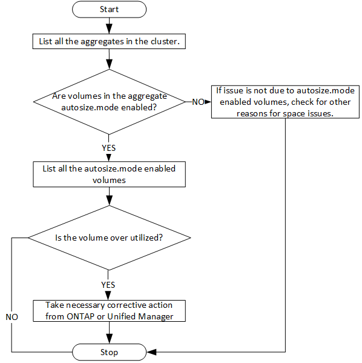

= Determinare i problemi di spazio negli aggregati utilizzando le API
:allow-uri-read: 
:icons: font
:imagesdir: ../media/

[role="lead"]
È possibile utilizzare le API del data center in Active IQ Unified Manager per monitorare la disponibilità e l'utilizzo dello spazio nei volumi.  È possibile determinare i problemi di spazio nel volume e identificare le risorse di archiviazione sovrautilizzate o sottoutilizzate.

Le API del data center per gli aggregati recuperano le informazioni rilevanti sullo spazio disponibile e utilizzato, nonché sulle impostazioni di efficienza del risparmio di spazio.  È anche possibile filtrare le informazioni recuperate in base ad attributi specifici.

Un metodo per determinare la mancanza di spazio negli aggregati è verificare se nell'ambiente sono presenti volumi con la modalità autosize abilitata.  Dovresti quindi identificare quali volumi sono sovrautilizzati ed eseguire eventuali azioni correttive.

Il seguente diagramma di flusso illustra il processo di recupero delle informazioni sui volumi con la modalità autosize abilitata:

Questo flusso presuppone che i cluster siano già stati creati in ONTAP e aggiunti a Unified Manager.

. Ottieni la chiave del cluster, a meno che tu non conosca il valore:
+
[cols="3*"]
|===
| Categoria | Verbo HTTP | Sentiero 

 a| 
centro dati
 a| 
OTTENERE
 a| 
`/datacenter/cluster/clusters`

|===
. Utilizzando la chiave del cluster come parametro di filtro, interrogare gli aggregati su quel cluster.
+
[cols="3*"]
|===
| Categoria | Verbo HTTP | Sentiero 

 a| 
centro dati
 a| 
OTTENERE
 a| 
`/datacenter/storage/aggregates`

|===
. In base alla risposta, analizzare l'utilizzo dello spazio degli aggregati e determinare quali aggregati presentano problemi di spazio.  Per ogni aggregato con problemi di spazio, ottenere la chiave aggregata dallo stesso output JSON.
. Utilizzando ciascuna chiave aggregata, filtrare tutti i volumi che hanno il valore per il parametro autosize.mode come `grow.`
+
[cols="3*"]
|===
| Categoria | Verbo HTTP | Sentiero 

 a| 
centro dati
 a| 
OTTENERE
 a| 
`/datacenter/storage/volumes`

|===
. Analizzare quali volumi sono sovrautilizzati.
. Eseguire tutte le azioni correttive necessarie, come lo spostamento del volume tra gli aggregati, per risolvere i problemi di spazio nel volume.  È possibile eseguire queste azioni dall'interfaccia utente Web di ONTAP o Unified Manager.

