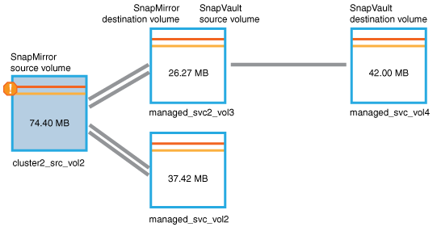

= Identificare il problema ed eseguire azioni correttive per un lavoro di protezione non riuscito
:allow-uri-read: 
:icons: font
:imagesdir: ../media/

[role="lead"]
Si esamina il messaggio di errore di errore del processo nel campo Causa nella pagina Dettagli evento e si determina che il processo non è riuscito a causa di un errore di copia snapshot.  Si passa quindi alla pagina dei dettagli Volume/Salute per raccogliere maggiori informazioni.

.Prima di iniziare
È necessario disporre del ruolo di amministratore dell'applicazione.

Il messaggio di errore fornito nel campo Causa nella pagina Dettagli evento contiene il seguente testo relativo al processo non riuscito:

[listing]
----
Protection Job Failed. Reason: (Transfer operation for
relationship 'cluster2_src_svm:cluster2_src_vol2->cluster3_dst_svm:
managed_svc2_vol3' ended unsuccessfully. Last error reported by
Data ONTAP: Failed to create Snapshot copy 0426cluster2_src_vol2snap
on volume cluster2_src_svm:cluster2_src_vol2. (CSM: An operation
failed due to an ONC RPC failure.)
Job Details
----
Questo messaggio fornisce le seguenti informazioni:

* Un processo di backup o mirroring non è stato completato correttamente.
+
Il lavoro prevedeva una relazione di protezione tra il volume sorgente `cluster2_src_vol2` sul server virtuale `cluster2_src_svm` e il volume di destinazione `managed_svc2_vol3` sul server virtuale denominato `cluster3_dst_svm` .

* Un processo di copia snapshot non è riuscito per `0426cluster2_src_vol2snap` sul volume sorgente `cluster2_src_svm:/cluster2_src_vol2` .

In questo scenario è possibile identificare la causa e le potenziali azioni correttive dell'errore del processo.  Tuttavia, per risolvere l'errore è necessario accedere all'interfaccia utente Web di System Manager o ai comandi ONTAP CLI.

.Passi
. Si esamina il messaggio di errore e si determina che un processo di copia snapshot non è riuscito sul volume di origine, il che indica che probabilmente c'è un problema con il volume di origine.
+
Facoltativamente, potresti cliccare sul link *Dettagli lavoro* alla fine del messaggio di errore, ma ai fini di questo scenario, scegli di non farlo.

. Decidi di provare a risolvere l'evento, quindi procedi come segue:
+
.. Fare clic sul pulsante *Assegna a* e selezionare *Io* dal menu.
.. Fare clic sul pulsante *Riconosci* per non continuare a ricevere notifiche di avviso ripetute, se sono stati impostati avvisi per l'evento.
.. Facoltativamente, puoi anche aggiungere delle note sull'evento.

. Fare clic sul campo *Origine* nel riquadro *Riepilogo* per visualizzare i dettagli sul volume di origine.
+
Il campo *Origine* contiene il nome dell'oggetto di origine: in questo caso, il volume su cui è stato pianificato il processo di copia Snapshot.

+
La pagina dei dettagli Volume/Salute viene visualizzata per `cluster2_src_vol2` , che mostra il contenuto della scheda Protezione.

. Osservando il grafico della topologia di protezione, si nota un'icona di errore associata al primo volume nella topologia, che è il volume di origine per la relazione SnapMirror .
+
Sono visibili anche le barre orizzontali nell'icona del volume sorgente, che indicano le soglie di avviso e di errore impostate per quel volume.

+

. Posizionando il cursore sull'icona di errore si apre la finestra di dialogo pop-up che mostra le impostazioni della soglia e si nota che il volume ha superato la soglia di errore, il che indica un problema di capacità.
. Fare clic sulla scheda *Capacità*.
+
Informazioni sulla capacità del volume `cluster2_src_vol2` schermi.

. Nel pannello *Capacità*, puoi vedere un'icona di errore nel grafico a barre, che indica ancora una volta che la capacità del volume ha superato il livello di soglia impostato per il volume.
. Sotto il grafico della capacità, puoi vedere che l'aumento automatico del volume è stato disabilitato e che è stata impostata una garanzia di spazio sul volume.
+
Potresti decidere di abilitare l'aumento automatico, ma ai fini di questo scenario, decidi di indagare ulteriormente prima di prendere una decisione su come risolvere il problema di capacità.

. Scorrendo verso il basso fino all'elenco *Eventi* si noterà che sono stati generati gli eventi Protection Job Failed, Volume Days Until Full e Volume Space Full.
. Nell'elenco *Eventi*, fai clic sull'evento *Spazio volume pieno* per ottenere maggiori informazioni, dopo aver deciso che questo evento sembra il più pertinente al tuo problema di capacità.
+
Nella pagina Dettagli evento viene visualizzato l'evento Spazio volume pieno per il volume di origine.

. Nell'area *Riepilogo* puoi leggere il campo Causa dell'evento: `The full threshold set at 90% is breached. 45.38 MB (95.54%) of 47.50 MB is used` .
. Sotto l'area Riepilogo sono presenti le azioni correttive suggerite.
+
[TIP]
====
Le azioni correttive suggerite vengono visualizzate solo per alcuni eventi, pertanto quest'area non è visibile per tutti i tipi di eventi.

====
+
Fai clic sull'elenco delle azioni suggerite che potresti eseguire per risolvere l'evento Spazio volume pieno:

+
** Abilita l'aumento automatico su questo volume.
** Ridimensiona il volume.
** Abilita ed esegui la deduplicazione su questo volume.
** Abilita ed esegui la compressione su questo volume.

. Si decide di abilitare l'aumento automatico sul volume, ma per farlo è necessario determinare lo spazio libero disponibile sull'aggregato padre e l'attuale tasso di crescita del volume:
+
.. Guarda l'aggregato genitore, `cluster2_src_aggr1` , nel riquadro *Dispositivi correlati*.
+
[TIP]
====
È possibile fare clic sul nome dell'aggregato per ottenere ulteriori dettagli sull'aggregato.

====
+
Si determina che l'aggregato dispone di spazio sufficiente per abilitare l'aumento automatico del volume.

.. Nella parte superiore della pagina, osserva l'icona che indica un incidente critico e leggi il testo sotto l'icona.
+
Si determina che "Giorni per il completamento: Meno di un giorno | Tasso di crescita giornaliero: 5,4%".

. Vai a System Manager o accedi a ONTAP CLI per abilitare `volume autogrow` opzione.
+
[TIP]
====
Prendi nota dei nomi del volume e dell'aggregato in modo da averli a disposizione quando attivi l'aumento automatico.

====
. Dopo aver risolto il problema di capacità, torna alla pagina dei dettagli *Evento* di Unified Manager e contrassegna l'evento come risolto.

