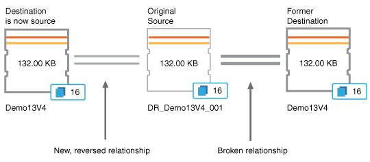

= Eseguire un failover e un failback della relazione di protezione
:allow-uri-read: 
:icons: font
:imagesdir: ../media/

[role="lead"]
Quando un volume di origine nella relazione di protezione viene disabilitato a causa di un guasto hardware o di un disastro, è possibile utilizzare le funzionalità della relazione di protezione in Unified Manager per rendere la destinazione di protezione accessibile in lettura/scrittura ed eseguire il failover su tale volume finché l'origine non torna online; a quel punto, è possibile eseguire il failover sull'origine originale quando è disponibile per fornire dati.

.Prima di iniziare
* È necessario disporre del ruolo di Amministratore dell'applicazione o Amministratore dell'archiviazione.
* Per eseguire questa operazione è necessario aver configurato OnCommand Workflow Automation .

.Passi
. link:task_break_snapmirror_relationship_from_health_volume_details.html["Interrompere la relazione SnapMirror"].
+
È necessario interrompere la relazione prima di poter convertire la destinazione da un volume di protezione dati a un volume di lettura/scrittura e prima di poter invertire la relazione.

. link:task_reverse_protection_relationships_from_health_volume_details.html["Invertire il rapporto di protezione"].
+
Quando il volume sorgente originale sarà nuovamente disponibile, potresti decidere di ristabilire la relazione di protezione originale ripristinando il volume sorgente.  Prima di poter ripristinare la sorgente, è necessario sincronizzarla con i dati scritti nella destinazione precedente.  Utilizzare l'operazione di risincronizzazione inversa per creare una nuova relazione di protezione invertendo i ruoli della relazione originale e sincronizzando il volume di origine con la destinazione precedente.  Viene creata una nuova copia Snapshot di base per la nuova relazione.

+
La relazione invertita è simile a una relazione a cascata:

+

. link:task_break_snapmirror_relationship_from_health_volume_details.html["Interrompere la relazione SnapMirror invertita"].
+
Quando il volume sorgente originale viene risincronizzato e può nuovamente gestire i dati, utilizzare l'operazione di interruzione per interrompere la relazione invertita.

. link:task_remove_protection_relationship_voldtls.html["Rimuovi la relazione"].
+
Quando la relazione invertita non è più necessaria, è necessario rimuoverla prima di ristabilire la relazione originale.

. link:task_resynchronize_protection_relationships_voldtls.html["Risincronizzare la relazione"].
+
Utilizzare l'operazione di risincronizzazione per sincronizzare i dati dall'origine alla destinazione e ristabilire la relazione originale.

