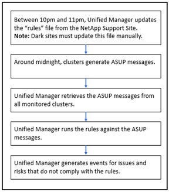

= Come vengono generati gli eventi della piattaforma Active IQ
:allow-uri-read: 
:icons: font
:imagesdir: ../media/

[role="lead"]
Gli incidenti e i rischi della piattaforma Active IQ vengono convertiti in eventi Unified Manager come mostrato nel diagramma seguente.

Come puoi vedere, il file delle regole compilato sulla piattaforma Active IQ viene mantenuto aggiornato, i messaggi AutoSupport del cluster vengono generati quotidianamente e Unified Manager aggiorna quotidianamente l'elenco degli eventi.
