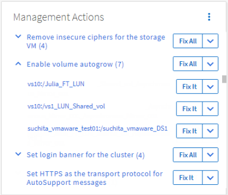

= Risolvi i problemi utilizzando la correzione automatica di Unified Manager
:allow-uri-read: 
:icons: font
:imagesdir: ../media/

[role="lead"]
Ci sono alcuni eventi che Unified Manager può diagnosticare in modo approfondito e fornire una soluzione univoca utilizzando il pulsante *Correggi*.  Se disponibili, tali risoluzioni vengono visualizzate nella Dashboard, nella pagina dei dettagli dell'evento e nella selezione Analisi del carico di lavoro nel menu di navigazione a sinistra.

La maggior parte degli eventi ha diverse possibili risoluzioni, visualizzate nella pagina dei dettagli dell'evento, in modo da poter implementare la soluzione migliore utilizzando ONTAP System Manager o ONTAP CLI.  Un'azione *Correggi* è disponibile quando Unified Manager ha stabilito che esiste un'unica soluzione per risolvere il problema e che può essere risolto utilizzando un comando ONTAP CLI.

.Passi
. Per visualizzare gli eventi che possono essere risolti dalla *Dashboard*, fare clic su *Dashboard*.
+

. Per risolvere uno qualsiasi dei problemi che Unified Manager può risolvere, fare clic sul pulsante *Risolvi*.  Per risolvere un problema che riguarda più oggetti, fare clic sul pulsante *Correggi tutto*.

Per informazioni sui problemi che possono essere risolti tramite la correzione automatica, vederelink:..//storage-mgmt/reference_what_ontap_issues_can_unified_manager_fix.html["Quali problemi può risolvere Unified Manager"] .
