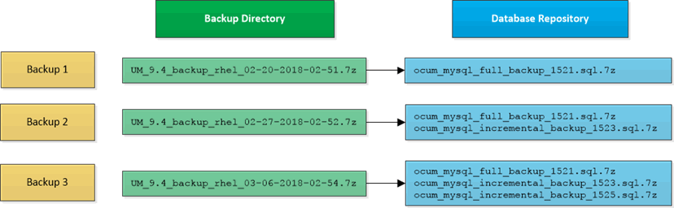

= Backup e ripristino tramite dump del database MySQL
:allow-uri-read: 
:icons: font
:imagesdir: ../media/

[role="lead"]
Un backup dump del database MySQL è una copia del database e dei file di configurazione Active IQ Unified Manager che è possibile utilizzare in caso di errore del sistema o perdita di dati.  È possibile pianificare la scrittura di un backup su una destinazione locale o su una destinazione remota.  Si consiglia vivamente di definire una posizione remota esterna al sistema host Active IQ Unified Manager .

[NOTE]
====
Il dump del database MySQL è il meccanismo di backup predefinito quando Unified Manager è installato su un server Linux e Windows.  Tuttavia, se Unified Manager gestisce un numero elevato di cluster e nodi, o se i backup di MySQL richiedono molte ore per essere completati, è possibile eseguire il backup utilizzando copie Snapshot.  Questa funzionalità è disponibile su Red Hat Enterprise Linux e Windows.

====
Un backup dump del database è costituito da un singolo file nella directory di backup e da uno o più file nella directory del repository del database.  Il file nella directory di backup è molto piccolo perché contiene solo un puntatore ai file presenti nella directory del repository del database, necessari per ricreare il backup.

La prima volta che si genera un backup del database, viene creato un singolo file nella directory di backup e un file di backup completo nella directory del repository del database.  La volta successiva che si genera un backup, viene creato un singolo file nella directory di backup e un file di backup incrementale nella directory del repository del database che contiene le differenze rispetto al file di backup completo.  Questo processo continua man mano che si creano backup aggiuntivi, fino al raggiungimento dell'impostazione di conservazione massima, come mostrato nella figura seguente.

[NOTE]
====
Non rinominare o rimuovere nessuno dei file di backup in queste due directory, altrimenti qualsiasi operazione di ripristino successiva non riuscirà.

====
Se si scrivono i file di backup sul sistema locale, è necessario avviare un processo per copiare i file di backup in una posizione remota, in modo che siano disponibili nel caso in cui si verifichi un problema di sistema che richieda un ripristino completo.

Prima di iniziare un'operazione di backup, Active IQ Unified Manager esegue un controllo di integrità per verificare che tutti i file e le directory di backup richiesti esistano e siano scrivibili.  Controlla anche che ci sia abbastanza spazio sul sistema per creare il file di backup.
