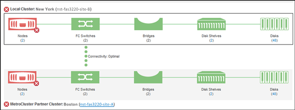

= Controllare lo stato dei cluster in una configurazione MetroCluster
:allow-uri-read: 
:icons: font
:imagesdir: ../media/

[role="lead"]
È possibile utilizzare Active IQ Unified Manager (Unified Manager) per verificare lo stato operativo dei cluster e dei relativi componenti nelle configurazioni MetroCluster su FC e MetroCluster su IP.  Se i cluster sono stati coinvolti in un evento di prestazioni rilevato da Unified Manager, lo stato di integrità può aiutare a determinare se un problema hardware o software ha contribuito all'evento.

.Prima di iniziare
* È necessario disporre del ruolo di Operatore, Amministratore dell'applicazione o Amministratore dell'archiviazione.
* È necessario aver analizzato un evento di prestazioni per una configurazione MetroCluster e ottenuto il nome del cluster coinvolto.
* Entrambi i cluster nella configurazione MetroCluster su FC e IP devono essere monitorati dalla stessa istanza di Unified Manager.

== Determinare lo stato del cluster in MetroCluster tramite la configurazione FC

Per determinare lo stato di integrità del cluster in una configurazione MetroCluster su FC, seguire questi passaggi.

.Passi
. Nel riquadro di navigazione a sinistra, fare clic su *Gestione eventi* per visualizzare l'elenco degli eventi.
. Nel pannello dei filtri, seleziona tutti i filtri MetroCluster nella categoria *Tipo di origine*.  Vengono visualizzati tutti gli eventi generati nel tuo ambiente per tutte le configurazioni MetroCluster .
. Accanto a un evento MetroCluster , fare clic sul nome del cluster.
+
[NOTE]
====
Se non vengono visualizzati eventi MetroCluster , è possibile utilizzare la barra di ricerca per cercare il nome del cluster coinvolto nell'evento correlato alla configurazione MetroCluster su FC.

====
+
Viene visualizzata la vista Integrità: tutti i cluster con informazioni dettagliate sull'evento.

. Selezionare la scheda *Connettività MetroCluster * per visualizzare lo stato della connessione tra il cluster selezionato e il suo cluster partner.
+

+
In questo esempio vengono visualizzati i nomi e i componenti del cluster locale e del suo cluster partner.  Un'icona gialla o rossa indica un evento di integrità per il componente evidenziato.  L'icona Connettività rappresenta il collegamento tra i cluster.  È possibile puntare il cursore del mouse su un'icona per visualizzare le informazioni sull'evento oppure fare clic sull'icona per visualizzare gli eventi.  Un problema di salute in uno dei due cluster potrebbe aver contribuito all'evento.

+
Unified Manager monitora il componente NVRAM del collegamento tra i cluster.  Se l'icona degli switch FC sul cluster locale o partner oppure l'icona della connettività sono rosse, è possibile che l'evento di prestazioni sia stato causato da un problema di integrità del collegamento.

. Selezionare la scheda *Replica MetroCluster *.
+
image::../media/opm_um_mcc_replication_tab_png.gif[Scheda Replica MetroCluster di Unified Manager]

+
In questo esempio, se l'icona NVRAM sul cluster locale o partner è gialla o rossa, un problema di integrità della NVRAM potrebbe aver causato l'evento di prestazioni.  Se nella pagina non sono presenti icone rosse o gialle, l'evento relativo alle prestazioni potrebbe essere stato causato da un problema di prestazioni nel cluster partner.

== Determinare lo stato del cluster nella configurazione MetroCluster su IP

Per determinare lo stato di integrità del cluster in una configurazione MetroCluster su IP, seguire questi passaggi.

.Passi
. Nel riquadro di navigazione a sinistra, fare clic su *Gestione eventi* per visualizzare l'elenco degli eventi.
. Nel pannello filtro, nella categoria *Tipo di origine*, seleziona `MetroCluster Relationship` filtro.  Vengono visualizzati tutti gli eventi generati nel tuo ambiente per tutte le configurazioni MetroCluster .
+
[NOTE]
====
Se non riesci a visualizzare gli eventi MetroCluster segnalati, puoi utilizzare la barra di ricerca per cercare in base al nome del cluster coinvolto nell'evento correlato alla tua configurazione MetroCluster su IP.

====
. Accanto all'evento MetroCluster pertinente, fare clic sul nome del cluster.  Viene visualizzata la pagina Cluster con i dettagli di quel cluster.  Per informazioni su come determinare i problemi di salute, vederelink:../storage-mgmt/task_monitor_metrocluster_configurations.html["Monitora i problemi di connettività nella configurazione MetroCluster su IP"] .

