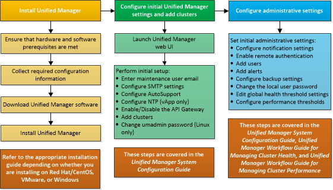

= Panoramica della sequenza di installazione
:allow-uri-read: 
:icons: font
:imagesdir: ../media/

[role="lead"]
Il flusso di lavoro di installazione descrive le attività che è necessario eseguire prima di poter utilizzare Unified Manager.

In queste sezioni vengono descritti ciascuno degli elementi mostrati nel flusso di lavoro riportato di seguito.

