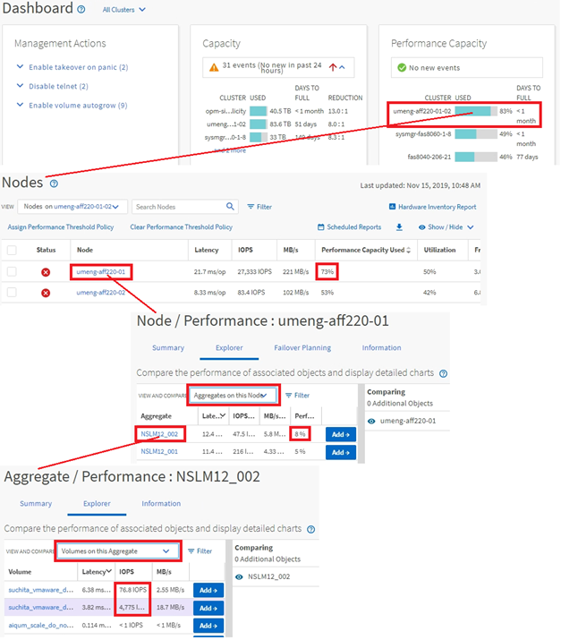

= Monitorare la navigazione degli oggetti del cluster
:allow-uri-read: 
:icons: font
:imagesdir: ../media/

[role="lead"]
È possibile monitorare le prestazioni di tutti gli oggetti in qualsiasi cluster gestito da Unified Manager.  Il monitoraggio degli oggetti di archiviazione fornisce una panoramica delle prestazioni del cluster e degli oggetti e include il monitoraggio degli eventi relativi alle prestazioni.  È possibile visualizzare le prestazioni e gli eventi a un livello elevato oppure è possibile analizzare più approfonditamente i dettagli delle prestazioni degli oggetti e degli eventi delle prestazioni.

Questo è un esempio delle tante possibili navigazioni degli oggetti cluster:

. Dalla pagina Dashboard, esamina i dettagli nel pannello Capacità delle prestazioni per identificare il cluster che utilizza la maggiore capacità delle prestazioni e fai clic sul grafico a barre per passare all'elenco dei nodi per quel cluster.
. Identifica il nodo con il valore di capacità di prestazioni più elevato utilizzato e fai clic su quel nodo.
. Dalla pagina Nodo/Esplora prestazioni, fare clic su *Aggregati su questo nodo* dal menu Visualizza e confronta.
. Identifica l'aggregato che utilizza la maggiore capacità di prestazioni e fai clic su tale aggregato.
. Dalla pagina Esplora aggregato/prestazioni, fare clic su *Volumi su questo aggregato* dal menu Visualizza e confronta.
. Identificare i volumi che utilizzano il maggior numero di IOPS.

È opportuno esaminare questi volumi per verificare se applicare una policy QoS o una policy Performance Service Level, oppure modificare le impostazioni della policy, in modo che tali volumi non utilizzino una percentuale così elevata di IOPS sul cluster.

