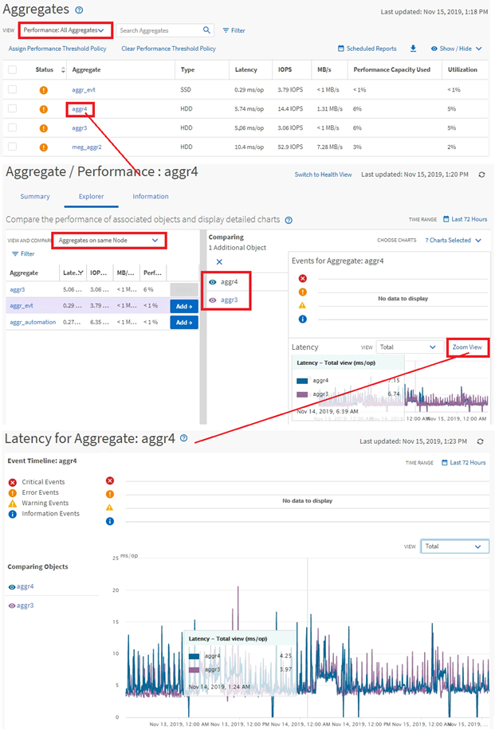

= Monitoraggio delle prestazioni del cluster e navigazione
:allow-uri-read: 
:icons: font
:imagesdir: ../media/

[role="lead"]
È possibile monitorare le prestazioni di tutti i cluster gestiti da Unified Manager.  Il monitoraggio dei cluster fornisce una panoramica delle prestazioni dei cluster e degli oggetti e include il monitoraggio degli eventi relativi alle prestazioni.  È possibile visualizzare le prestazioni e gli eventi a un livello elevato oppure è possibile analizzare più approfonditamente i dettagli delle prestazioni e degli eventi delle prestazioni del cluster e dell'oggetto.

Questo è un esempio dei tanti possibili percorsi di navigazione delle prestazioni del cluster:

. Nel riquadro di navigazione a sinistra, fare clic su *Archiviazione* > *Aggregati*.
. Per visualizzare informazioni sulle prestazioni in tali aggregati, selezionare la vista Prestazioni: Tutti gli aggregati.
. Identifica l'aggregato che vuoi analizzare e fai clic sul nome dell'aggregato per accedere alla pagina Esplora aggregati/prestazioni.
. Facoltativamente, seleziona altri oggetti da confrontare con questo aggregato nel menu Visualizza e confronta, quindi aggiungi uno degli oggetti al riquadro di confronto.
+
Le statistiche per entrambi gli oggetti appariranno nei grafici dei contatori per consentirne il confronto.

. Nel riquadro Confronto a destra nella pagina Explorer, fare clic su *Zoom vista* in uno dei grafici dei contatori per visualizzare i dettagli sulla cronologia delle prestazioni per quell'aggregato.

