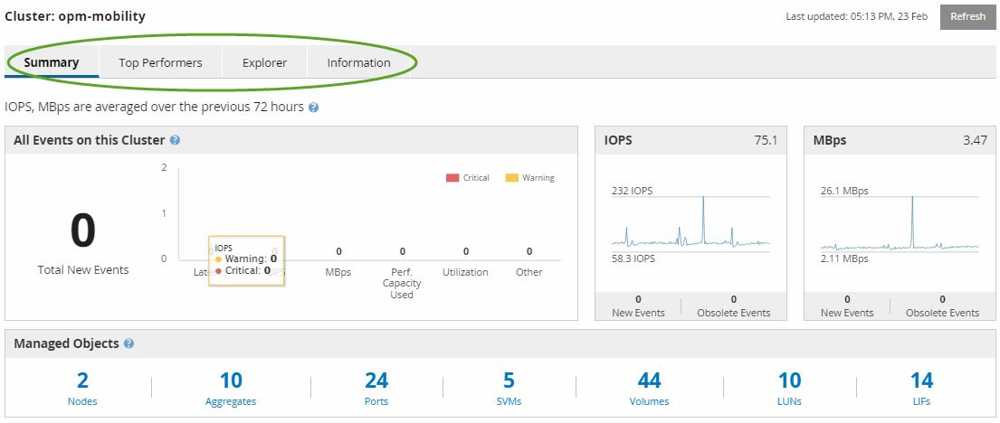

= Comprendere la pagina di destinazione del Performance Cluster
:allow-uri-read: 
:icons: font
:imagesdir: ../media/

[role="lead"]
La pagina di destinazione del cluster delle prestazioni fornisce una panoramica di alto livello delle prestazioni di un cluster selezionato, con particolare attenzione allo stato delle prestazioni dei primi 10 oggetti all'interno del cluster.  I problemi di prestazioni vengono visualizzati nella parte superiore della pagina, nel pannello Tutti gli eventi in questo cluster.

La pagina di destinazione del Performance Cluster fornisce una panoramica di alto livello di ciascun cluster gestito da un'istanza di Unified Manager.  Questa pagina fornisce informazioni su eventi e prestazioni e consente di monitorare e risolvere i problemi dei cluster.  L'immagine seguente mostra un esempio della landing page del Performance Cluster per il cluster denominato opm-mobility:

Il conteggio degli eventi nella pagina Riepilogo cluster potrebbe non corrispondere al conteggio degli eventi nella pagina Inventario eventi prestazioni.  Ciò avviene perché la pagina Riepilogo cluster può mostrare un evento in ciascuna barra Latenza e Utilizzo quando vengono violate le policy di soglia combinate, mentre la pagina Inventario eventi prestazioni mostra un solo evento quando viene violata una policy combinata.

[NOTE]
====
Se un cluster è stato rimosso dalla gestione di Unified Manager, lo stato *Rimosso* viene visualizzato a destra del nome del cluster nella parte superiore della pagina.

====