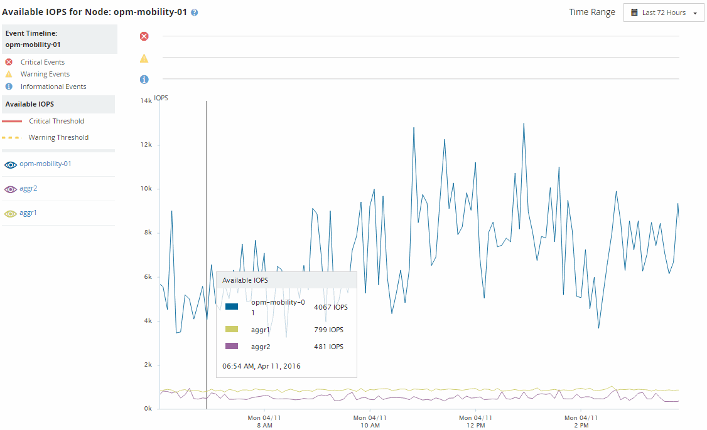

= Visualizza i nodi e aggrega i valori IOPS disponibili
:allow-uri-read: 
:icons: font
:imagesdir: ../media/

[role="lead"]
È possibile monitorare i valori IOPS disponibili per tutti i nodi o per tutti gli aggregati in un cluster, oppure è possibile visualizzare i dettagli per un singolo nodo o aggregato.

I valori IOPS disponibili vengono visualizzati nelle pagine Inventario prestazioni e nei grafici delle pagine Esplora prestazioni per nodi e aggregati.  Ad esempio, quando si visualizza un nodo nella pagina Node/Performance Explorer, è possibile selezionare il grafico del contatore "IOPS disponibili" dall'elenco, in modo da poter confrontare i valori IOPS disponibili per il nodo e più aggregati su quel nodo.

Monitorare il contatore IOPS disponibili consente di identificare:

* I nodi o gli aggregati che hanno i valori IOPS più elevati disponibili per aiutare a determinare dove potranno essere distribuiti i carichi di lavoro futuri.
* I nodi o gli aggregati che hanno i valori IOPS più piccoli disponibili per identificare le risorse da monitorare per potenziali problemi di prestazioni futuri.
* I volumi e i LUN più occupati su un aggregato che ha un valore IOPS disponibile ridotto.

