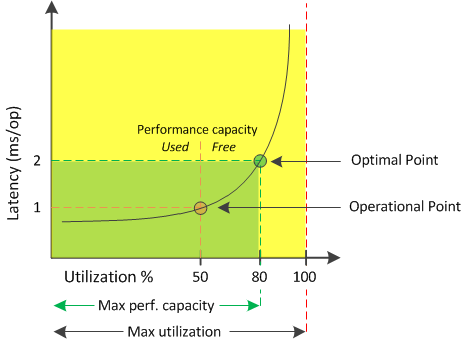

= Quale capacità di prestazione è utilizzata
:allow-uri-read: 
:icons: font
:imagesdir: ../media/

[role="lead"]
Il contatore della capacità prestazionale utilizzata consente di identificare se le prestazioni di un nodo o di un aggregato stanno raggiungendo un punto in cui potrebbero peggiorare se i carichi di lavoro aumentano.  Può anche mostrarti se un nodo o un aggregato è attualmente sovrautilizzato in determinati periodi di tempo.  La capacità prestazionale utilizzata è simile all'utilizzo, ma la prima fornisce maggiori informazioni sulle capacità prestazionali disponibili in una risorsa fisica per un carico di lavoro specifico.

La capacità di prestazione ottimale utilizzata è il punto in cui un nodo o un aggregato ha un utilizzo e una latenza (tempo di risposta) ottimali e viene utilizzato in modo efficiente.  Nella figura seguente è mostrata una curva di latenza rispetto all'utilizzo di un aggregato.

In questo esempio, il _punto operativo_ identifica che l'aggregato sta attualmente operando al 50% di utilizzo con una latenza di 1,0 ms/op.  Sulla base delle statistiche acquisite dall'aggregato, Unified Manager determina che per questo aggregato è disponibile ulteriore capacità di prestazioni.  In questo esempio, il _punto ottimale_ è identificato come il punto in cui l'aggregato è all'80% di utilizzo con una latenza di 2,0 ms/op.  Pertanto, è possibile aggiungere più volumi e LUN a questo aggregato, in modo che i sistemi vengano utilizzati in modo più efficiente.

Si prevede che il contatore della capacità di prestazione utilizzata sia un numero maggiore rispetto al contatore "`utilizzo`" perché la capacità di prestazione aggiunge un impatto sulla latenza.  Ad esempio, se un nodo o un aggregato viene utilizzato al 70%, il valore della capacità prestazionale potrebbe essere compreso tra l'80% e il 100%, a seconda del valore di latenza.

In alcuni casi, tuttavia, il contatore di utilizzo potrebbe essere più alto nella pagina Dashboard.  Ciò è normale perché la dashboard aggiorna i valori correnti del contatore a ogni periodo di raccolta; non visualizza le medie su un periodo di tempo come le altre pagine nell'interfaccia utente di Unified Manager.  Il contatore della capacità prestazionale utilizzata è più indicato come indicatore della prestazione media in un periodo di tempo, mentre il contatore di utilizzo è più indicato per determinare l'utilizzo istantaneo di una risorsa.
