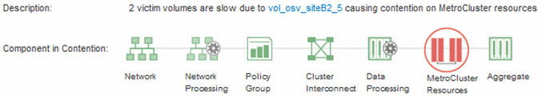
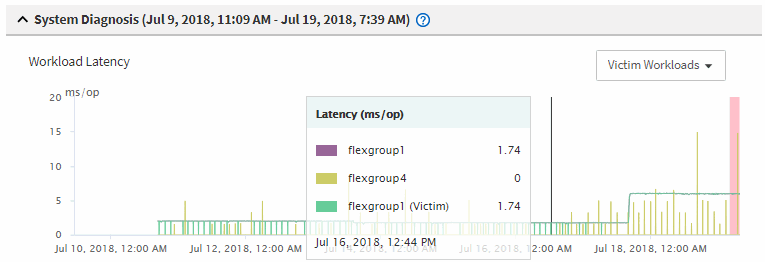

= Analizza un evento di prestazioni dinamiche su un cluster in una configurazione MetroCluster
:allow-uri-read: 
:icons: font
:imagesdir: ../media/

[role="lead"]
È possibile utilizzare Unified Manager per analizzare il cluster in una configurazione MetroCluster in cui è stato rilevato un evento di prestazioni.  È possibile identificare il nome del cluster, l'ora di rilevamento dell'evento e i carichi di lavoro _bullo_ e _vittima_ coinvolti.

.Prima di iniziare
* È necessario disporre del ruolo di Operatore, Amministratore dell'applicazione o Amministratore dell'archiviazione.
* Per una configurazione MetroCluster devono essere presenti eventi di prestazione nuovi, riconosciuti o obsoleti.
* Entrambi i cluster nella configurazione MetroCluster devono essere monitorati dalla stessa istanza di Unified Manager.

.Passi
. Visualizza la pagina *Dettagli evento* per visualizzare le informazioni sull'evento.
. Esaminare la descrizione dell'evento per vedere i nomi dei carichi di lavoro coinvolti e il loro numero.
+
In questo esempio, l'icona Risorse MetroCluster è rossa, a indicare che le risorse MetroCluster sono in competizione.  Posiziona il cursore sull'icona per visualizzarne la descrizione.

+

. Prendi nota del nome del cluster e dell'ora di rilevamento dell'evento, che puoi utilizzare per analizzare gli eventi relativi alle prestazioni sul cluster partner.
. Nei grafici, esamina i carichi di lavoro delle _vittime_ per confermare che i loro tempi di risposta siano superiori alla soglia di prestazione.
+
In questo esempio, il carico di lavoro della vittima viene visualizzato nel testo in evidenza.  I grafici di latenza mostrano, ad alto livello, un modello di latenza coerente per i carichi di lavoro delle vittime coinvolti.  Anche se la latenza anomala dei carichi di lavoro della vittima ha attivato l'evento, un modello di latenza coerente potrebbe indicare che i carichi di lavoro stanno funzionando entro l'intervallo previsto, ma che un picco di I/O ha aumentato la latenza e attivato l'evento.

+

+
Se di recente hai installato un'applicazione su un client che accede a questi carichi di lavoro di volume e tale applicazione invia loro una quantità elevata di I/O, potresti prevedere un aumento delle latenze.  Se la latenza per i carichi di lavoro rientra nell'intervallo previsto, lo stato dell'evento cambia in obsoleto e rimane in questo stato per più di 30 minuti, probabilmente puoi ignorare l'evento.  Se l'evento è in corso e rimane nel nuovo stato, puoi indagare ulteriormente per determinare se altri problemi lo hanno causato.

. Nel grafico Capacità di elaborazione del carico di lavoro, selezionare *Carichi di lavoro in eccesso* per visualizzare i carichi di lavoro in eccesso.
+
La presenza di carichi di lavoro eccessivi indica che l'evento potrebbe essere stato causato da uno o più carichi di lavoro sul cluster locale che hanno utilizzato eccessivamente le risorse MetroCluster .  I carichi di lavoro più pesanti presentano un'elevata deviazione nella velocità di scrittura (MB/s).

+
Questo grafico mostra, ad alto livello, il modello di velocità di scrittura (MB/s) per i carichi di lavoro.  È possibile esaminare il modello MB/s di scrittura per identificare una velocità effettiva anomala, che potrebbe indicare che un carico di lavoro sta utilizzando eccessivamente le risorse MetroCluster .

+
Se nell'evento non sono coinvolti carichi di lavoro indesiderati, l'evento potrebbe essere stato causato da un problema di integrità del collegamento tra i cluster o da un problema di prestazioni sul cluster partner.  È possibile utilizzare Unified Manager per verificare lo stato di entrambi i cluster in una configurazione MetroCluster .  È anche possibile utilizzare Unified Manager per verificare e analizzare gli eventi relativi alle prestazioni nel cluster partner.

