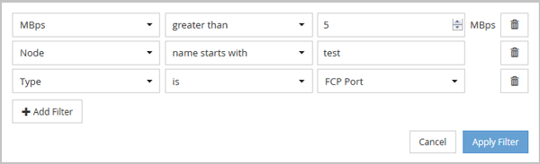

= Filtra i dati nelle pagine Prestazioni inventario oggetti
:allow-uri-read: 
:icons: font
:imagesdir: ../media/

[role="lead"]
È possibile filtrare i dati nelle pagine Prestazioni inventario oggetti per individuare rapidamente i dati in base a criteri specifici.  È possibile utilizzare il filtro per restringere il contenuto delle pagine Prestazioni inventario oggetti in modo da visualizzare solo i risultati specificati.  Questo fornisce un metodo molto efficiente per visualizzare solo i dati sulle prestazioni a cui sei interessato.

Puoi utilizzare il pannello Filtraggio per personalizzare la visualizzazione della griglia in base alle tue preferenze.  Le opzioni di filtro disponibili si basano sul tipo di oggetto visualizzato nella griglia.  Se sono attualmente applicati dei filtri, il numero di filtri applicati viene visualizzato a destra del pulsante Filtro.

Sono supportati tre tipi di parametri di filtro.

|===
| Parametro | Validazione 

 a| 
Stringa (testo)
 a| 
Gli operatori sono *contiene*, *inizia con*, *termina con* e *non contiene*.

 a| 
Numero
 a| 
Gli operatori sono *maggiore di*, *minore di*, *nell'ultimo* e *tra*.

 a| 
Enum (testo)
 a| 
Gli operatori sono *is* e *is not*.

|===
I campi Colonna, Operatore e Valore sono obbligatori per ciascun filtro; i filtri disponibili riflettono le colonne filtrabili nella pagina corrente.  Il numero massimo di filtri che puoi applicare è quattro.  I risultati filtrati si basano su parametri di filtro combinati.  I risultati filtrati si applicano a tutte le pagine della ricerca filtrata, non solo alla pagina attualmente visualizzata.

È possibile aggiungere filtri utilizzando il pannello Filtraggio.

. Nella parte superiore della pagina, fare clic sul pulsante *Filtro*.  Viene visualizzato il pannello Filtraggio.
. Fare clic sull'elenco a discesa a sinistra e selezionare un oggetto, ad esempio _Cluster_ o un contatore delle prestazioni.
. Fare clic sull'elenco a discesa centrale e selezionare l'operatore che si desidera utilizzare.
. Nell'ultimo elenco, seleziona o immetti un valore per completare il filtro per quell'oggetto.
. Per aggiungere un altro filtro, fare clic su *+Aggiungi filtro*.  Viene visualizzato un campo filtro aggiuntivo.  Completare questo filtro utilizzando la procedura descritta nei passaggi precedenti.  Tieni presente che dopo aver aggiunto il quarto filtro, il pulsante *+Aggiungi filtro* non verrà più visualizzato.
. Fare clic su *Applica filtro*.  Le opzioni di filtro vengono applicate alla griglia e il numero di filtri viene visualizzato a destra del pulsante Filtro.
. Utilizzare il pannello Filtraggio per rimuovere singoli filtri facendo clic sull'icona del cestino a destra del filtro da rimuovere.
. Per rimuovere tutti i filtri, fare clic su *Reimposta* nella parte inferiore del pannello di filtraggio.

== Esempio di filtraggio

L'illustrazione mostra il pannello Filtraggio con tre filtri.  Il pulsante *+Aggiungi filtro* viene visualizzato quando si hanno meno del massimo di quattro filtri.

Dopo aver cliccato su *Applica filtro*, il pannello Filtraggio si chiude, applica i filtri e mostra il numero di filtri applicati (image:../media/opm_filters_applied.gif[""] ).
