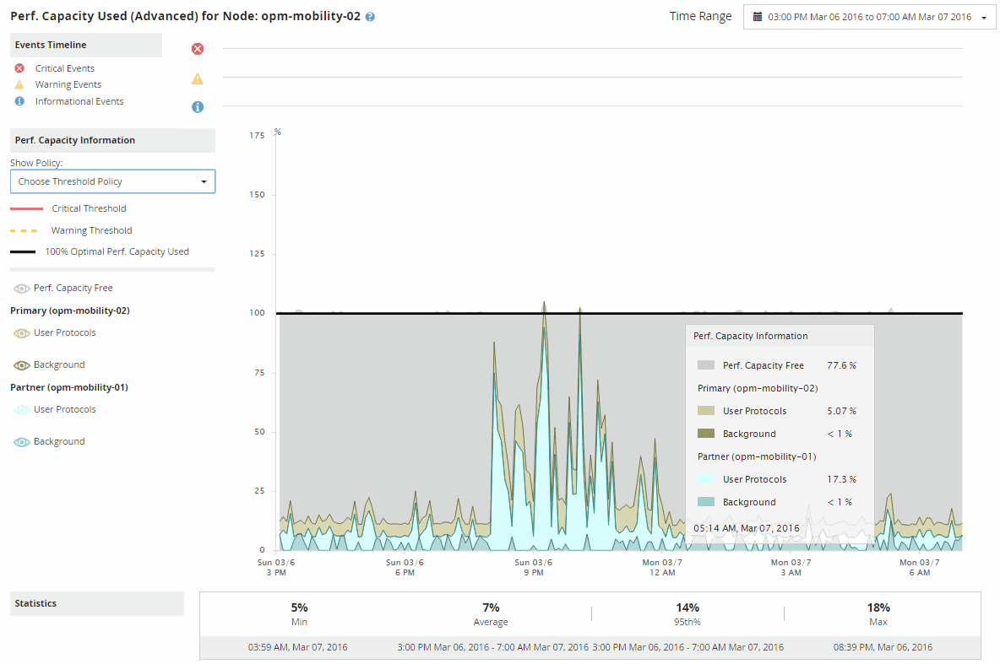

= Utilizzare il grafico di ripartizione della capacità di prestazione utilizzata per la pianificazione del failover
:allow-uri-read: 
:icons: font
:imagesdir: ../media/

[role="lead"]
Il grafico dettagliato Capacità di prestazione utilizzata - Ripartizione mostra la capacità di prestazione utilizzata per il nodo primario e il nodo partner.  Mostra anche la quantità di capacità di prestazioni libera sul nodo Estimated Takeover.  Queste informazioni ti aiutano a stabilire se potresti avere un problema di prestazioni in caso di guasto del nodo partner.

Oltre a mostrare la capacità di prestazioni totale utilizzata per i nodi, il grafico di ripartizione suddivide i valori per ciascun nodo in protocolli utente e processi in background.

* I protocolli utente sono le operazioni di I/O dalle applicazioni utente verso e dal cluster.
* I processi in background sono i processi di sistema interni coinvolti nell'efficienza di archiviazione, nella replicazione dei dati e nello stato del sistema.

Questo ulteriore livello di dettaglio consente di determinare se un problema di prestazioni è causato dall'attività dell'applicazione utente o da processi di sistema in background, come la deduplicazione, la ricostruzione RAID, la pulizia del disco e le copie SnapMirror .

.Passi
. Accedere alla pagina *Pianificazione delle prestazioni/failover dei nodi* per il nodo che fungerà da nodo di acquisizione stimata.
. Dal selettore *Intervallo di tempo*, seleziona il periodo di tempo per il quale visualizzare le statistiche storiche nella griglia del contatore e nei grafici del contatore.
+
Vengono visualizzati i grafici dei contatori con le statistiche per il nodo primario, il nodo partner e il nodo di acquisizione stimata.

. Dall'elenco *Scegli grafici*, seleziona *Perf.  Capacità utilizzata*.
. Nella *Perf.  Grafico Capacità utilizzata*, selezionare *Ripartizione* e fare clic su *Vista zoom*.
+
Il grafico dettagliato per Perf.  Viene visualizzata la capacità utilizzata.

+

. Spostare il cursore sul grafico dettagliato per visualizzare le informazioni sulla capacità prestazionale utilizzata nella finestra popup.
+
Il Perf.  La percentuale di capacità libera è la capacità di prestazione disponibile sul nodo di acquisizione stimata.  Indica quanta capacità di prestazioni è rimasta sul nodo di acquisizione dopo un failover.  Se è pari a 0%, un failover causerà un aumento della latenza a un livello inaccettabile sul nodo di acquisizione.

. Valutare l'opportunità di adottare misure correttive per evitare una bassa percentuale di capacità libera di prestazioni.
+
Se si prevede di avviare un failover per la manutenzione del nodo, scegliere un momento in cui il nodo partner fallisca quando la percentuale di capacità di prestazioni disponibile non è pari a 0.

