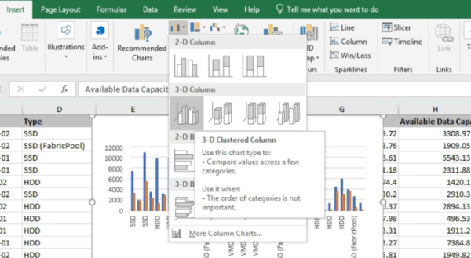

= Crea un report per mostrare grafici aggregati della capacità totale rispetto a quella disponibile
:allow-uri-read: 
:icons: font
:imagesdir: ../media/

[role="lead"]
È possibile creare un report per analizzare la capacità totale di archiviazione e quella impegnata in un formato grafico Excel.

.Prima di iniziare
* È necessario disporre del ruolo di Amministratore dell'applicazione o Amministratore dell'archiviazione.

Per aprire una vista Integrità: Tutti gli aggregati, scaricare la vista in Excel, creare un grafico della capacità totale e impegnata, caricare il file Excel personalizzato e pianificare il report finale, procedere come segue.

.Passi
. Nel riquadro di navigazione a sinistra, fare clic su *Archiviazione* > *Aggregati*.
. Selezionare *Report* > *Scarica Excel*.
+
image::../media/download_excel_menu.png[Uno screenshot dell'interfaccia utente che mostra come scaricare Excel dai report.]

+
A seconda del browser utilizzato, potrebbe essere necessario fare clic su *OK* per salvare il file.

. In Excel, apri il file scaricato.
. Se necessario, fare clic su *Abilita modifica*.
. Nel foglio dati, fare clic con il pulsante destro del mouse sulla colonna Tipo e selezionare *Ordina* > *Ordina dalla A alla Z*.
+
image::../media/sort_01.png[Uno screenshot dell'interfaccia utente che mostra come selezionare l'ordinamento nella colonna Tipo.]

+
In questo modo i dati verranno organizzati in base al tipo di archiviazione, ad esempio:

+
** Disco rigido
** Ibrido
** SSD
** SSD (FabricPool)

. Seleziona il `Type, Total Data Capacity,` E `Available Data Capacity` colonne.
. Nel menu *Inserisci*, seleziona un `3-D column` grafico.
+
Il grafico appare sulla scheda dati.

+

. Fare clic con il pulsante destro del mouse sul grafico e selezionare *Sposta grafico*.
. Selezionare *Nuovo foglio* e rinominare il foglio *Grafici di archiviazione totale*.
+
[NOTE]
====
Assicuratevi che il nuovo foglio venga visualizzato dopo le schede informative e quelle tecniche.

====
. Assegnare al grafico il titolo *Capacità totale rispetto a capacità disponibile*.
. Utilizzando i menu *Design* e *Formato*, disponibili quando il grafico è selezionato, è possibile personalizzare l'aspetto del grafico.
. Una volta soddisfatti, salvate il file con le modifiche.  Non modificare il nome o il percorso del file.
+
image::../media/total_vs_available_capacity.png[Uno screenshot dell'interfaccia utente che mostra un grafico della capacità totale rispetto a quella disponibile.]

. In Unified Manager, seleziona *Report* > *Carica Excel*.
+
[NOTE]
====
Assicurati di essere nella stessa vista in cui hai scaricato il file Excel.

====
. Seleziona il file Excel che hai modificato.
. Fare clic su *Apri*.
. Fare clic su *Invia*.
+
Accanto alla voce di menu *Report* > *Carica Excel* appare un segno di spunta.

+
image::../media/upload_excel.png[Uno screenshot dell'interfaccia utente che mostra come caricare Excel nei report.]

. Fare clic su *Report pianificati*.
. Fare clic su *Aggiungi pianificazione* per aggiungere una nuova riga alla pagina *Pianificazioni report* in modo da poter definire le caratteristiche della pianificazione per il nuovo report.
+
[NOTE]
====
Selezionare il formato *XLSX* per il report.

====
. Inserisci un nome per la pianificazione del report e completa gli altri campi del report, quindi fai clic sul segno di spunta (image:../media/blue_check.gif[""] ) alla fine della riga.
+
Il rapporto viene inviato immediatamente a scopo di verifica.  Successivamente, il report viene generato e inviato tramite e-mail ai destinatari elencati utilizzando la frequenza specificata.

In base ai risultati mostrati nel report, potresti voler bilanciare il carico sugli aggregati.
