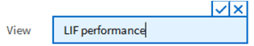

= Pianifica un rapporto
:allow-uri-read: 
:icons: font
:imagesdir: ../media/

[role="lead"]
Dopo aver creato una vista o un file Excel di cui si desidera pianificare la generazione e la distribuzione regolari, è possibile pianificare il report.

.Prima di iniziare
* È necessario disporre del ruolo di Amministratore dell'applicazione o Amministratore dell'archiviazione.
* È necessario aver configurato le impostazioni del server SMTP nella pagina *Generale* > *Notifiche* affinché il motore di reporting possa inviare report come allegati e-mail all'elenco dei destinatari dal server Unified Manager.
* Il server di posta elettronica deve essere configurato per consentire l'invio di allegati con le email generate.

Per testare e pianificare la generazione di un report per una vista, attenersi alla seguente procedura.  Seleziona o personalizza la visualizzazione che desideri utilizzare.  La seguente procedura utilizza una vista di rete che mostra le prestazioni delle interfacce di rete, ma è possibile utilizzare qualsiasi vista si desideri.

.Passi
. Apri la tua visuale.  In questo esempio viene utilizzata la visualizzazione di rete predefinita che mostra le prestazioni LIF.  Nel riquadro di navigazione a sinistra, fare clic su *Rete > Interfacce di rete*.
. Personalizza la visualizzazione in base alle tue esigenze utilizzando le funzionalità integrate di Unified Manager.
. Dopo aver personalizzato la vista, puoi specificare un nome univoco nel campo *Visualizzazione* e fare clic sul segno di spunta per salvarlo.
+

. È possibile utilizzare le funzionalità avanzate di Microsoft® Excel per personalizzare il report. Per i dettagli, vederelink:task_use_excel_to_customize_your_report.html["Utilizzo di Excel per personalizzare il report"] .
. Per visualizzare l'output prima di pianificarlo o condividerlo:
+
[cols="2*"]
|===
| Opzione | Descrizione 

 a| 
*Se hai utilizzato Excel per personalizzare il report*
 a| 
Visualizza il file Excel scaricato esistente.

 a| 
*Se non hai utilizzato Excel per personalizzare il report*
 a| 
Scarica il report come file *CSV*, *PDF* o *XLSX*.

|===
+
Aprire il file con un'applicazione installata, come Microsoft Excel (CSV/XSLX) o Adobe Acrobat (PDF).

. Se sei soddisfatto del report, clicca su *Report pianificati*.
. Nella pagina Pianificazioni report, fare clic su *Aggiungi pianificazione*.
. Accetta il nome predefinito, che è una combinazione del nome della vista e della frequenza, oppure personalizza il *nome della pianificazione*.
. Per testare il report pianificato per la prima volta, aggiungi solo te stesso come *destinatario*.  Una volta soddisfatti, aggiungere gli indirizzi email di tutti i destinatari del report.
. Specificare la frequenza con cui il report verrà generato e inviato ai destinatari.  Puoi scegliere *Giornaliero*, *Settimanale* o *Mensile*.
. Selezionare il formato, *PDF*, *CSV* o *XSLX*.
+
[NOTE]
====
Per i report in cui hai utilizzato Excel per personalizzare il contenuto, seleziona sempre *XSLX*.

====
. Fare clic sul segno di spunta (image:../media/blue_check.gif[""] ) per salvare la pianificazione del report.
+
image::../media/scheduled_reports.gif[Uno screenshot dell'interfaccia utente che mostra come salvare la pianificazione del report.]

+
Il rapporto viene inviato immediatamente a scopo di verifica.  Successivamente, il report viene generato e inviato tramite e-mail ai destinatari elencati utilizzando la frequenza pianificata.

