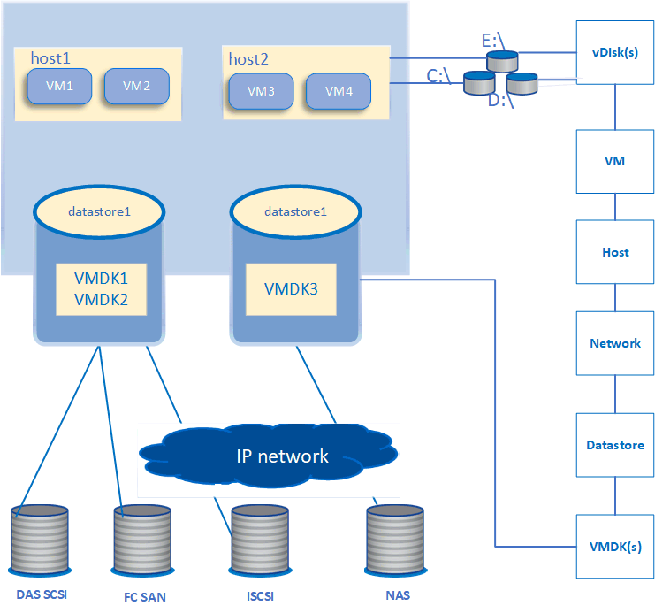

= Monitorare l'infrastruttura virtuale VMware
:allow-uri-read: 
:icons: font
:imagesdir: ../media/

[role="lead"]
Active IQ Unified Manager fornisce visibilità sulle macchine virtuali (VM) nella tua infrastruttura virtuale e consente il monitoraggio e la risoluzione dei problemi di archiviazione e prestazioni nel tuo ambiente virtuale.  È possibile utilizzare questa funzionalità per determinare eventuali problemi di latenza nell'ambiente di archiviazione o quando viene segnalato un evento di prestazioni sul server vCenter.

Una tipica distribuzione di un'infrastruttura virtuale su ONTAP presenta vari componenti distribuiti tra i livelli di elaborazione, rete e archiviazione.  Eventuali ritardi nelle prestazioni di un'applicazione VM potrebbero verificarsi a causa di una combinazione di latenze riscontrate dai vari componenti ai rispettivi livelli.  Questa funzionalità è utile per gli amministratori di storage e vCenter Server e per i tecnici IT generalisti che hanno bisogno di analizzare un problema di prestazioni in un ambiente virtuale e capire in quale componente si è verificato il problema.

Ora è possibile accedere a vCenter Server dal menu vCenter della sezione VMware.  La vista panoramica di ciascuna macchina virtuale elencata presenta il collegamento *VCENTER SERVER* nella VISTA TOPOLOGIA che avvia vCenter Server in un nuovo browser.  È anche possibile utilizzare il pulsante *Espandi topologia* per avviare vCenter Server e fare clic sul pulsante *Visualizza in vCenter* per visualizzare i datastore in vCenter Server.

Unified Manager presenta il sottosistema sottostante di un ambiente virtuale in una vista topologica per determinare se si è verificato un problema di latenza nel nodo di elaborazione, nella rete o nell'archiviazione.  La vista evidenzia anche l'oggetto specifico che causa il ritardo nelle prestazioni per l'adozione di misure correttive e la risoluzione del problema di fondo.

Un'infrastruttura virtuale distribuita su storage ONTAP include i seguenti oggetti:

* vCenter Server: un piano di controllo centralizzato per la gestione delle VM VMware, degli host ESXi e di tutti i componenti correlati in un ambiente virtuale.  Per ulteriori informazioni su vCenter Server, consultare la documentazione VMware.
* Host: un sistema fisico o virtuale che esegue ESXi, il software di virtualizzazione di VMware, e ospita la VM.
* Datastore: i datastore sono oggetti di archiviazione virtuali connessi agli host ESXi.  I datastore sono entità di archiviazione gestibili di ONTAP, come LUN o volumi, utilizzati come repository per i file VM, come file di registro, script, file di configurazione e dischi virtuali.  Sono collegati agli host nell'ambiente tramite una connessione di rete SAN o IP.  Gli archivi dati esterni a ONTAP mappati su vCenter Server non sono supportati né visualizzati su Unified Manager.
* VM: una macchina virtuale VMware.
* Dischi virtuali: i dischi virtuali sui datastore appartenenti alle VM che hanno un'estensione come VMDK.  I dati di un disco virtuale vengono archiviati sul VMDK corrispondente.
* VMDK: un disco di macchina virtuale sul datastore che fornisce spazio di archiviazione per i dischi virtuali.  Per ogni disco virtuale esiste un VMDK corrispondente.

Questi oggetti sono rappresentati in una vista topologica della VM.

*Virtualizzazione VMware su ONTAP*

*Flusso di lavoro dell'utente*

Il diagramma seguente mostra un tipico caso d'uso della vista topologia VM:

image::../media/vm_workflow.gif[flusso di lavoro della macchina virtuale]

== Cosa non è supportato

* Gli archivi dati esterni a ONTAP e mappati alle istanze di vCenter Server non sono supportati su Unified Manager.  Non sono supportate nemmeno le VM con dischi virtuali su tali datastore.
* Non è supportato un datastore che si estende su più LUN.
* Gli archivi dati che utilizzano la traduzione degli indirizzi di rete (NAT) per la mappatura dei dati LIF (endpoint di accesso) non sono supportati.
* L'esportazione di volumi o LUN come datastore su cluster diversi con gli stessi indirizzi IP in una configurazione con più LIF non è supportata poiché Unified Manager non è in grado di identificare quale datastore appartiene a quale cluster.
+
Esempio: supponiamo che il cluster A abbia il datastore A. Il datastore A viene esportato tramite dati LIF con lo stesso indirizzo IP xxxx e la VM A viene creata su questo datastore.  Analogamente, il cluster B ha il datastore B. Il datastore B viene esportato tramite LIF dati con lo stesso indirizzo IP xxxx e la VM B viene creata sul datastore B. UM non sarà in grado di mappare il datastore A per la topologia della VM A sul volume ONTAP /LUN corrispondente né di mappare la VM B.

* Come datastore sono supportati solo i volumi NAS e SAN (iSCSI e FCP per VMFS), i volumi virtuali (vVols) non sono supportati.
* Sono supportati solo i dischi virtuali iSCSI.  I dischi virtuali di tipo NVMe e SATA non sono supportati.
* Le viste non consentono di generare report per analizzare le prestazioni dei vari componenti.
* Per la configurazione del disaster recovery (DR) della macchina virtuale di storage (VM di storage) supportata solo per l'infrastruttura virtuale su Unified Manager, la configurazione deve essere modificata manualmente in vCenter Server in modo che punti alle LUN attive negli scenari di switchover e switchback.  Senza un intervento manuale, i loro archivi dati diventano inaccessibili.

